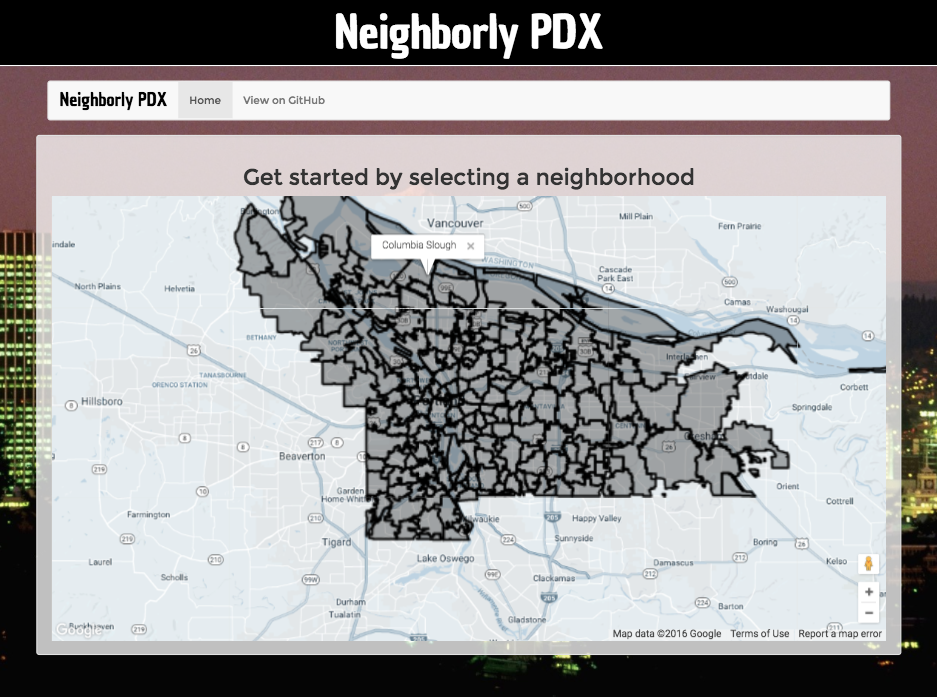
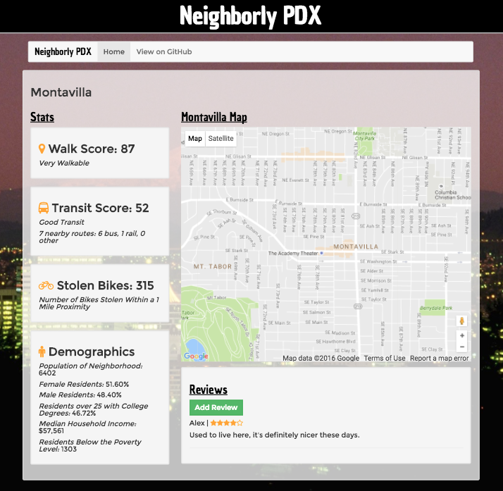

# _Neighborly PDX_

#### _11/9/2016_

#### By _**Stephen Burden, Eric Krause, Andrew Merrell, and Jackson Meyer**_

## Description

_Ember application that allows users to select and view key information about Portland neighborhoods._

[Click here to view](https://neighborly-pdx.pagefrontapp.com)

## Specifications

| Behavior         | Input         | Output         |
|------------------|---------------|----------------|
| App displays interactive map of Portland neighborhoods. | User loads webpage. | Page displays map with neighborhood boundaries. |
| User selects neighborhood | Click on highlighted area of google map. | Neighborhood page loads with information about that neighborhood. |
| Neighborhood page displays Walkscore, Google Maps, and Bike Index API . | Click on neighborhood. | Page loads with Walkscore, number of stolen bikes and a Google Map of the area. |
| User submits a review | Review form is filled out and submit is clicked. | Neighborhood page reloads with new review with star display for rating. |

## Prerequisites

_You will need the following things properly installed on your computer._

* _[Git](http://git-scm.com/)_
* _[Node.js](http://nodejs.org/) (with NPM)_
* _[Bower](http://bower.io/)_
* _[Ember CLI](http://ember-cli.com/)_
* _[PhantomJS](http://phantomjs.org/)_
* _Google Chrome Extension "Allow-Control-Allow-Origin:*"_

## Installation

* `git clone https://github.com/amcmerrell/neighborhood-ratings`
* `cd neighborhood-ratings`
* `npm install`
* `bower install`

## Running / Development

* `ember serve`
* _Visit your app at [http://localhost:4200](http://localhost:4200)._

## Viewing Live Version
* _Open Chrome and Enable cross origin resource sharing in the Google Chrome Extension "Allow-Control-Allow-Origin:*"_
* Go to: https://neighborly-pdx.pagefrontapp.com/
* _Click load unsafe scripts (if an API does not load)_

## Known Bugs
_There are currently no known bugs for this project. If you discover any issues, you can reach me via the contact details below._

## Support and contact details
_If you have any questions about this project, please contact Andrew at andrew.m.merrell@gmail.com or Stephen at spburden@hotmail.com_

## Technologies Used
* _JavaScript_
* _Ember_
* _Node.js_
* _Google Maps API_
* _Walkscore API_
* _Bike Index API_
* _Census Bureau API_
* _Sass_
* _HTML_

### License

*This webpage is licensed under the MIT license.*

Copyright (c) 2016 **_Stephen Burden, Eric Krause, Andrew Merrell, and Jackson Meyer_**
